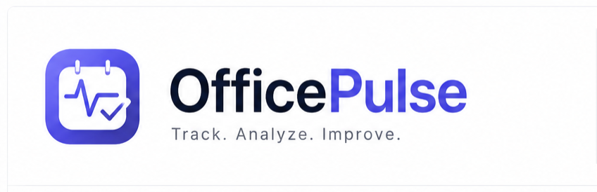

# OfficePulse – Personal Work Companion

<p align="center">
  
</p>

<p align="center">
  <strong>A modern personal work companion for tracking attendance, working hours, and productivity through a beautiful calendar-first dashboard.</strong>
</p>

<p align="center">
  
  
  
  
</p>


## 📖 About OfficePulse

OfficePulse is a lightweight, browser-based **Personal Work Companion** designed to help individuals manage their office attendance, working hours, and productivity from a single dashboard.

Unlike traditional attendance systems, OfficePulse follows a **calendar-first workflow**, allowing users to manage daily attendance directly from an interactive calendar while receiving meaningful insights through a clean, zero-scroll dashboard.

The application is built entirely with modern frontend technologies and stores data locally, making it fast, responsive, and easy to use without requiring a backend server.


# ✨ Features

### 📅 Smart Attendance Management

- Calendar-first attendance tracking
- Daily Check-In / Check-Out
- Break time management
- Automatic working hour calculation
- Edit existing attendance
- Delete attendance records
- Daily work notes

### 📊 Dashboard

- Today's Working Hours
- Weekly Working Hours
- Monthly Working Hours
- Average Working Hours
- Overtime Summary

### 🗓 Interactive Calendar

- Monthly Calendar View
- Click any date to Create / View / Edit attendance
- Color-coded attendance status
- Weekend highlighting
- Public Holiday integration
- Today's date indicator

### 📈 Insights

- Last 7 Days Summary
- Weekly Summary
- Activity Heatmap
- Working Hour Statistics

### 🌙 User Experience

- Zero Scroll Dashboard
- Responsive Design
- Light / Dark Theme
- Native Browser Notifications
- Smooth Micro Animations
- Modern Desktop-style Interface

# 🚀 Version 1.0 Highlights

- Zero-scroll dashboard
- Calendar-first workflow
- Browser Local Storage
- Public Holiday API integration
- Browser Notification API
- Web Animations API powered UI animations
- Fully frontend architecture

# 🛠 Technology Stack

| Technology | Purpose |
|------------|---------|
| HTML5 | Structure |
| CSS3 | Styling |
| Bootstrap 5 | Layout & Responsive UI |
| JavaScript (ES6+) | Application Logic |
| Web Animations API | UI Animations |
| Chart.js | Activity Graphs |
| Browser Local Storage | Offline Data Storage |
| Notification API | Browser Notifications |
| Public Holiday API | Holiday Calendar |

# 📂 Project Structure

```text
officepulse/
│
├── README.md
├── LICENSE
├── CHANGELOG.md
├── CONTRIBUTING.md
├── CODE_OF_CONDUCT.md
│
├── docs/
│   ├── SRS/
│   ├── SDD/
│   ├── UI/
│   ├── Architecture/
│   └── Images/
│
├── src/
│   ├── index.html
│   ├── css/
│   ├── js/
│   │   ├── api/
│   │   └── utils/
│   └── assets/
│
└── screenshots/
```

# 🧩 Application Architecture

```text
User

↓

Dashboard UI

↓

Application Controller (app.js)

↓

UI Components
Calendar
Calculator
Storage
Charts
Notifications

↓

Local Storage
Holiday API
```

The application follows a modular architecture where each JavaScript module has a single responsibility, making the project scalable and maintainable.

# 🎨 UI Philosophy

OfficePulse follows a modern **Desktop Productivity Dashboard** design philosophy.

### Design Principles

- Zero Scroll Layout
- Calendar-first workflow
- Minimal distractions
- Soft color palette
- Responsive design
- Smooth micro interactions
- Accessibility focused

Animations are intentionally subtle to enhance usability rather than distract the user.

# 📚 Documentation

Complete project documentation is available inside the `docs/` directory.

### Software Engineering Documents

- Software Requirements Specification (SRS)
- Software Design Document (SDD)

These documents describe the complete project requirements, architecture, module design, implementation strategy, and future roadmap.

# ⚙ Installation

Clone the repository

```bash
git clone https://github.com/lubdhesh18/OfficePulse.git
```

Navigate into the project

```bash
cd officepulse
```

Open the application

```text
src/index.html
```

No installation required.

No backend required.

No database required.

# 📌 Roadmap

### Version 1.0

- Attendance Dashboard
- Interactive Calendar
- Activity Graph
- Weekly Summary
- Browser Notifications
- Public Holiday Integration
- Local Storage

### Planned Future Enhancements

- Reports
- Analytics
- Timesheets
- Leave Management
- Cloud Synchronization
- Multi-user Support
- Mobile Version


# 🤝 Contributing

Contributions are welcome.

To contribute:

1. Fork the repository

2. Create a feature branch

```bash
git checkout -b feature/feature-name
```

3. Commit your changes

```bash
git commit -m "Add feature"
```

4. Push to GitHub

```bash
git push origin feature/feature-name
```

5. Open a Pull Request

Please ensure that your code follows the existing project structure and coding standards.

# 🍴 Forking

You are welcome to fork this repository for learning, experimentation, or personal projects.

If you build something inspired by OfficePulse, attribution is appreciated.

# 📄 License

This project is licensed under the MIT License.

See the [LICENSE](license) file for more information.


# 👨‍💻 Author

**Lubdhesh Rathor**

Associate QA Engineer

Building products with a focus on clean architecture, thoughtful user experience, and modern software engineering practices.

# 🙏 Acknowledgements

OfficePulse was designed using a documentation-first development approach. The project was planned through comprehensive Software Requirements Specification (SRS) and Software Design Document (SDD) before implementation began.

The application emphasizes clean architecture, modular development, maintainability, and user-centered design.


## ⭐ Support

If you found this project useful, consider giving it a ⭐ on GitHub.

It helps others discover the project and motivates future improvements.

